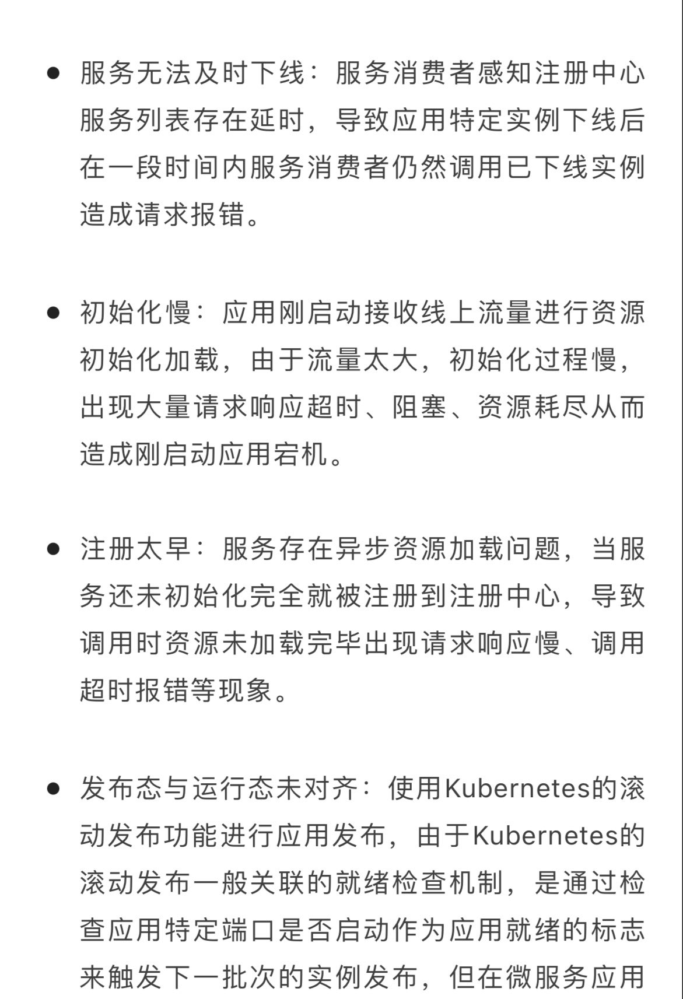

# K8S

### 测试环境迁移到k8s

1. mysql问题:

   mysql内token字段由100改为256,但是DBA操作错误,导致登录测试时,一直失败

2. 域名解析问题

3. apollo配置:

   早期apollo账号经过base64加密后,长度超过限制,因此mysql账号少写几位,迁移apollo后,新环境的配置,是最新的apollo账号,但是旧apollo用户密码未改,导致连接失败,pod健康检查失败

### 访问域名报`服务器异常或没网络`

1. F12,发现请求imp-test5报405错误
2. 手动访问`https://imp-test5.wsecar.com/accountWebImpl`,请求失败,不存在路径
3. 查看服务对应Service,配置正确
4. 查看imp-test5对应Ingress,发现更新转发配置,只有`/api/accountWebImpl/`转发,手动添加`/accountWebImpl`
5. 请求域名,报404,请求资源不存在.查看imp-test5的ingress配置文件,少了后半截,手动添加`rewrite ^/api/accountWebImpl/(.*) /$1 break;rewrite ^/accountWebImpl/(.*) /$1 break;`
6. 请求,回复正常

### 华为云容器服务

* 监听器个数不够,导致整个容器集群不可用

### k8s生产故障

[k8s网络诊断之我的流量去哪了](https://developer.aliyun.com/article/780661)

### k8s遇到的问题

### 测试环境电商服务调用网约车服务不通

* 问题现象:
  * 电商虚拟机环境服务调用网约车k8s环境一个服务,1个通1个不通,网约车这边两个服务都是正常的
* 问题排查:
  * telnet不通有2种原因,1个是端口未启动,另一个是安全组问题
* 问题原因:
  * 虚拟机调用容器是通过entbus转发的,entbus的svc绑定多个服务端口,转发给entbus的pod,由entbus的pod转发给具体的后端服务,具体的转发规则通过configmap挂载到pod内
  * 一开始fat06环境是没有挂载entbus-configmap,但是18930端口是通的,18933端口不通,以为不需要entbus-configmap,排查方向就一直在安全组
  * 后面发现,entbus-pod内部默认有一些规则的,18930刚好有,所以即时没挂载configmap,也是通的
